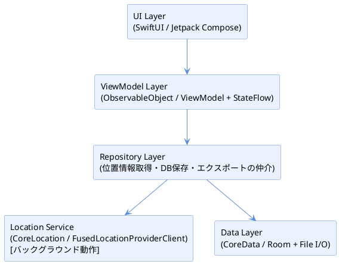
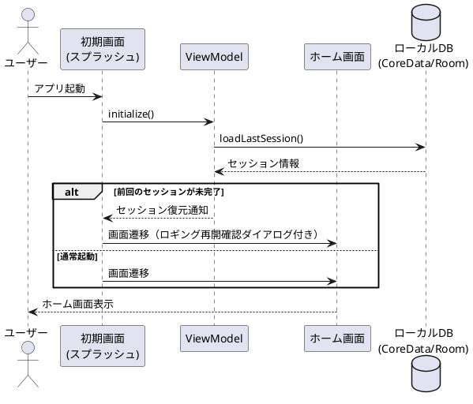
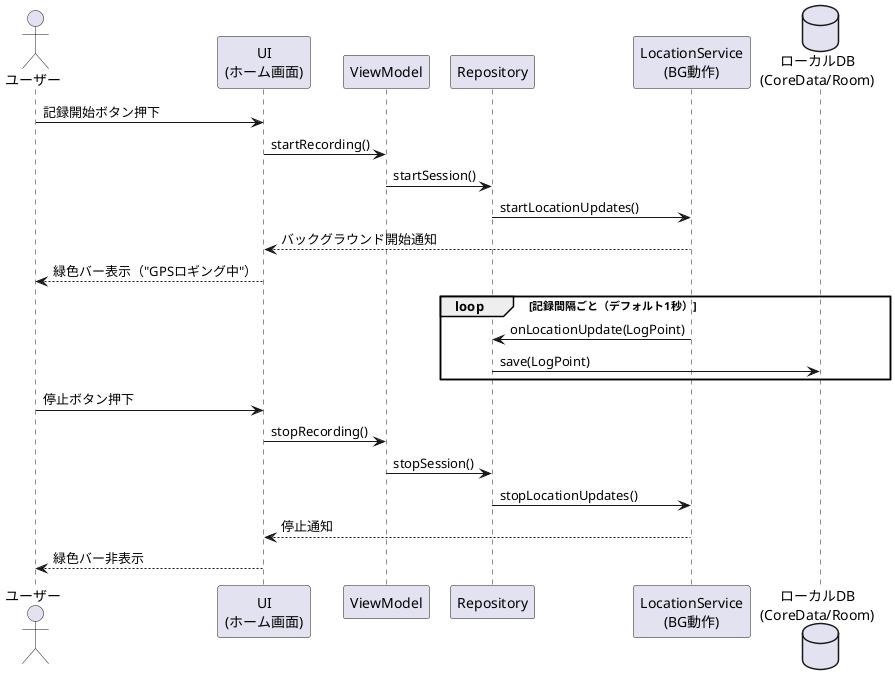
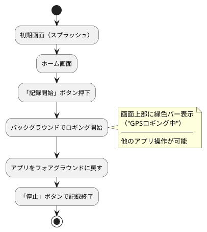
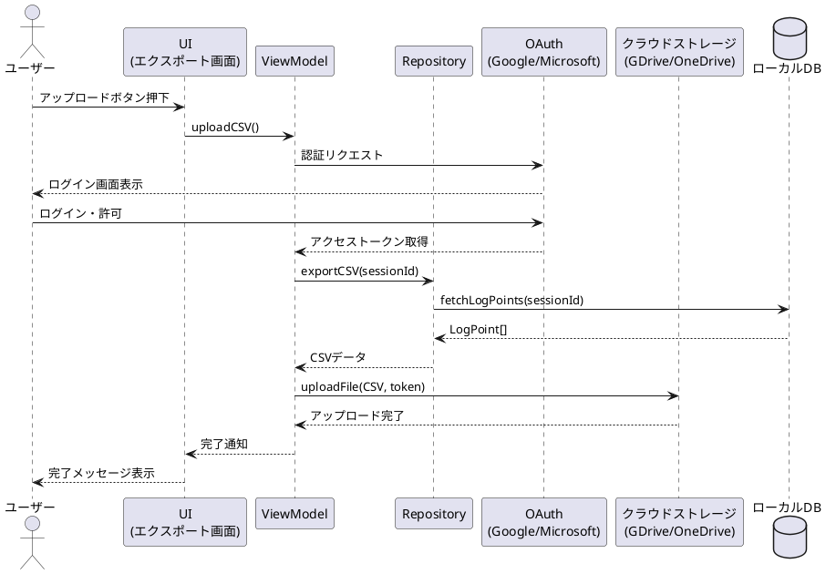
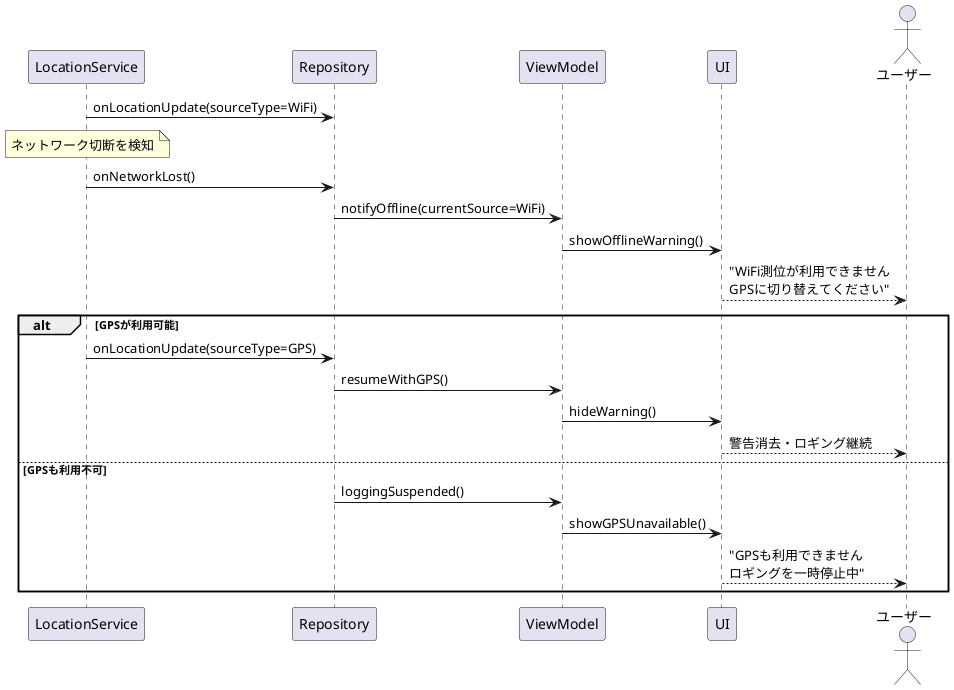
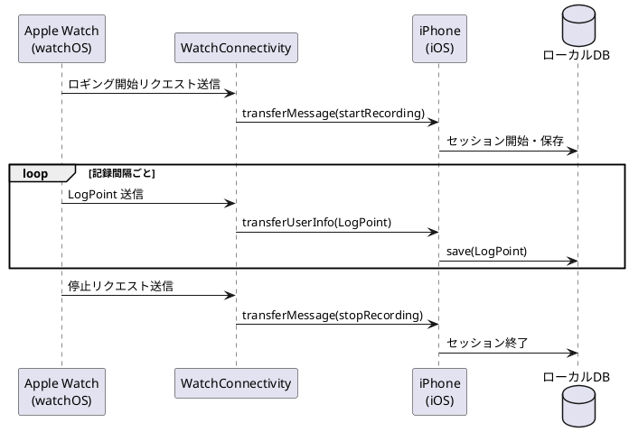
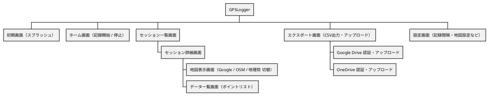

# GPSLogger アプリ 設計書

> 作成日: 2026-04-09 / 最終更新: 2026-04-09

---

## 1. プロジェクト概要

| 項目 | 内容 |
|------|------|
| アプリ名 | GPSLogger |
| 目的 | GPSによる位置情報の継続的なロギング・出力・可視化 |
| 対応プラットフォーム | iPhone / iPad / Apple Watch / Android |
| 測位方式 | GPS（優先）→ WiFi測位（フォールバック） |

---

## 2. 技術スタック

### iOS / iPadOS / watchOS
| 項目 | 技術 |
|------|------|
| 言語 | Swift |
| UIフレームワーク | SwiftUI |
| 位置情報 | CoreLocation |
| バックグラウンド処理 | Background Modes（Location updates） |
| ローカルDB | Core Data または SwiftData |
| 地図表示 | MapKit / WebView（OSM・地理院地図） |

### Android
| 項目 | 技術 |
|------|------|
| 言語 | Kotlin |
| UIフレームワーク | Jetpack Compose |
| 位置情報 | FusedLocationProviderClient（GPS → WiFi自動切替） |
| バックグラウンド処理 | Foreground Service |
| ローカルDB | Room（SQLite） |
| 地図表示 | Google Maps SDK / WebView（OSM・地理院地図） |

---

## 3. アーキテクチャ



パターン: **MVVM（Model-View-ViewModel）**

---

## 4. 機能仕様

### 4.1 アプリ起動

#### シーケンス図



---

### 4.2 GPSデータ記録機能

#### シーケンス図



#### 画面遷移フロー



#### 記録仕様
| 項目 | 仕様 |
|------|------|
| 記録間隔 | デフォルト: 1秒（任意の秒数に変更可能） |
| 測位精度 | 高精度（GPS） → 中精度（WiFi）自動切替 |
| バックグラウンド動作 | iOS: Background Modes / Android: Foreground Service |
| インジケーター | 画面最上部に緑色バー（ステータスバー領域） |

#### データモデル（ログ1件）
```
LogPoint {
  id          : UUID
  timestamp   : DateTime      // 記録時刻
  latitude    : Double        // 緯度
  longitude   : Double        // 経度
  altitude    : Double?       // 高度（m）
  accuracy    : Double        // 水平精度（m）
  speed       : Double?       // 速度（m/s）
  sourceType  : Enum(GPS, WiFi)
  sessionId   : UUID          // ロギングセッションID
}

Session {
  id          : UUID
  startTime   : DateTime
  endTime     : DateTime?
  name        : String        // セッション名（任意）
  pointCount  : Int
  fileIndex   : Int           // 1年超えで次ファイルへの連番
}
```

---

### 4.3 GPSデータ出力機能

#### シーケンス図（アップロード）



#### CSV出力フォーマット
```csv
id,timestamp,latitude,longitude,altitude,accuracy,speed,source
uuid1,2026-04-09T10:00:00+09:00,35.681236,139.767125,5.2,3.0,1.2,GPS
uuid2,2026-04-09T10:00:05+09:00,35.681300,139.767200,5.4,3.2,1.1,GPS
...
```

#### アップロード機能
| 項目 | 仕様 |
|------|------|
| 現状のアップロード先 | Google Drive / OneDrive（CSV保存） |
| 将来のアップロード先 | 独自サーバAPI（REST）※別途設計 |
| 形式 | CSV |
| 認証 | Google Drive / OneDrive の OAuth 認証のみ |

> アップロード機能を使う場合のみ認証が必要。アプリ内の記録・表示機能は認証不要。

#### データ保持ポリシー
| 項目 | 仕様 |
|------|------|
| 最大連続ロギング期間 | 1年（365日） |
| 1年超過時の動作 | 新規ファイルへ自動切替（ファイル名に連番付与） |

---

### 4.4 GPSデータ表示機能

#### 対応地図
| 地図 | 実装方式 | 備考 |
|------|----------|------|
| Google マップ | Google Maps SDK（ネイティブ） | APIキー必要 |
| OpenStreetMap | WebView（Leaflet.js） | 無料・APIキー不要 |
| 国土地理院 | WebView（地理院タイル） | 無料・日本詳細地図 |

#### 表示内容
- ログポイントをマーカーで表示
- ルート（軌跡）をポリライン（線）で表示
- セッション単位での表示切替
- タップで各ポイントの詳細情報表示（時刻・緯度経度・速度）

---

### 4.5 オフライン動作仕様

#### シーケンス図



| 状況 | 動作 |
|------|------|
| オフライン時（GPS利用中） | そのままGPSロギングを継続 |
| オフライン時（WiFiロギング中） | ユーザーへ警告メッセージを表示 |
| GPS・WiFi両方不可 | ロギング一時停止・メッセージ表示 |

---

### 4.6 Apple Watch 仕様

iPhone版と同等の機能を提供する。

#### シーケンス図（Watch ↔ iPhone 同期）



| 機能 | 仕様 |
|------|------|
| GPSロギング | iPhone版と同等（開始・停止） |
| データ表示 | 簡易表示（Watch画面サイズに最適化） |
| 地図表示 | コンパクトな地図ビュー |
| データ同期 | WatchConnectivity でiPhoneと同期 |

---

## 5. 画面構成（画面一覧）



---

## 6. 権限・パーミッション

### iOS
| 権限 | 用途 |
|------|------|
| `NSLocationAlwaysAndWhenInUseUsageDescription` | バックグラウンドGPS |
| `NSLocationWhenInUseUsageDescription` | フォアグラウンドGPS |
| Background Modes: Location updates | バックグラウンド測位 |

### Android
| 権限 | 用途 |
|------|------|
| `ACCESS_FINE_LOCATION` | GPS精密測位 |
| `ACCESS_COARSE_LOCATION` | WiFi測位 |
| `ACCESS_BACKGROUND_LOCATION` | バックグラウンド測位（Android 10+） |
| `FOREGROUND_SERVICE` | フォアグラウンドサービス |

---

## 7. 未決事項・TODO

- [x] アップロード先サービスの決定 → **現状: Google Drive / OneDrive、将来: 独自API**
- [x] 認証方式の決定 → **アップロード時のみ OAuth 認証（Google / Microsoft）**
- [x] Apple Watch 向け機能の詳細仕様 → **iPhone版と同等機能・WatchConnectivity で同期**
- [x] 記録間隔のデフォルト値・最小値の決定 → **デフォルト1秒・任意の秒数に変更可能**
- [x] オフライン時の動作仕様 → **GPSのみ継続・WiFiロギング中はメッセージ表示**
- [x] データの最大保持件数・ストレージ管理ポリシー → **最大1年・超過で新規ファイルへ自動切替**

---

## 8. 開発フェーズ案

| フェーズ | 内容 |
|----------|------|
| Phase 1 | iOS版 基本実装（初期画面・記録・CSV出力・地図表示） |
| Phase 2 | Android版 基本実装 |
| Phase 3 | Google Drive / OneDrive アップロード機能実装 |
| Phase 4 | Apple Watch 対応 |
| Phase 5 | 独自サーバAPI連携 |
| Phase 6 | UI/UX改善・テスト・リリース |
