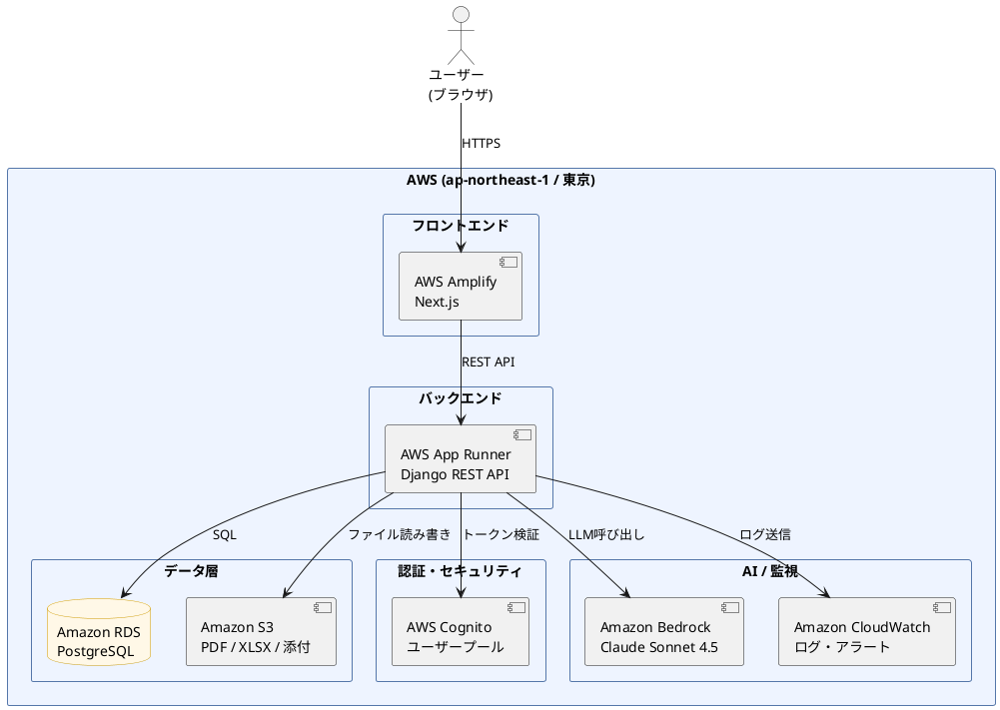
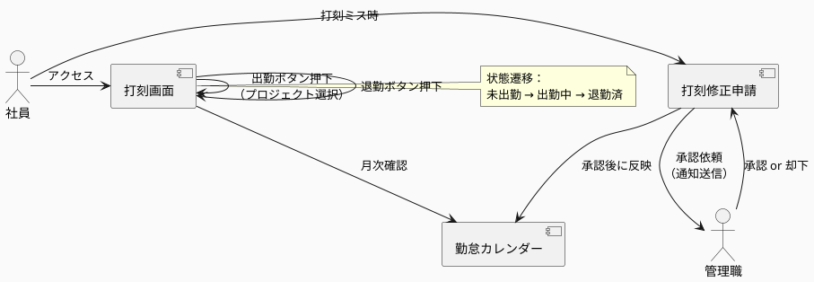
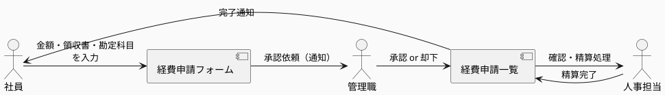
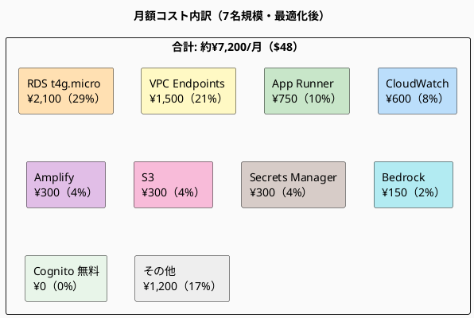

# 人事管理システム（HRM）基本設計書

**作成日**: 2026-04-09  
**バージョン**: 1.0

---

## 1. システム概要

### 1.1 目的
社員の勤怠・給与・目標管理・スキル管理を一元化し、人事業務の効率化・デジタル化を実現する社内向けWebアプリケーション。

### 1.2 対象ユーザー
| ロール | 説明 |
|---|---|
| 社員（プロジェクト従事者） | 自身の打刻・申請・目標入力 |
| 管理職（プロジェクト管理者） | 部下の承認・目標フィードバック・稼働管理 |
| 人事担当者 | 給与計算・社員情報管理・勤怠集計 |
| システム管理者 | アカウント作成・権限管理・マスタ管理 |

---

## 2. 技術スタック

### 2.1 構成
| レイヤー | 技術 | 補足 |
|---|---|---|
| フロントエンド | Next.js + TypeScript | SSR対応、App Router使用 |
| UIコンポーネント | shadcn/ui + Tailwind CSS | モダンなUIを効率よく構築 |
| 状態管理 | Zustand | 認証状態・グローバルデータ管理 |
| APIキャッシュ | React Query（TanStack Query） | サーバーデータのキャッシュ・再取得 |
| バックエンド | Django REST Framework（Python） | REST API サーバー |
| 認証 | Django REST Framework + SimpleJWT + AWS Cognito | JWT認証 + ユーザープール管理 |
| データベース | Amazon RDS for PostgreSQL | マネージドPostgreSQL（自動バックアップ付き） |
| ファイルストレージ | Amazon S3 | PDF・XLSX・添付ファイル保管 |
| フロントエンドホスティング | AWS Amplify | Next.jsのデプロイ・CDN配信 |
| バックエンドホスティング | AWS App Runner | Djangoコンテナの自動スケーリング実行 |
| コンテナ | Docker Compose | ローカル開発環境の統一 |
| AI・LLM | Amazon Bedrock（Claude Sonnet 4.5） | 日報補助・MBO添削など |
| 監視・ログ | Amazon CloudWatch | アクセスログ・エラーログ・アラート |
| CI/CD | AWS CodePipeline + GitHub Actions | 自動テスト・デプロイ |

### 2.2 AWSリージョン
- **メイン**: 東京（`ap-northeast-1`）
- **DR（災害対策）**: 大阪（`ap-northeast-3`）※将来対応

### 2.3 AWSアーキテクチャ図



### 2.4 開発環境ポート
```
フロントエンド : localhost:3000  (Next.js)
バックエンド   : localhost:8000  (Django REST)
データベース   : localhost:5432  (PostgreSQL ※ローカルはDockerで起動)
```

### 2.5 リポジトリ構成（モノレポ）
```
HRM/
├── backend/              # Django プロジェクト
│   ├── config/           # 設定ファイル（settings.py等）
│   ├── apps/
│   │   ├── auth/         # 認証・アカウント
│   │   ├── employees/    # 社員情報
│   │   ├── attendance/   # 出退勤
│   │   ├── projects/     # プロジェクト管理
│   │   ├── mbo/          # 目標管理
│   │   ├── salary/       # 給与計算
│   │   ├── expense/      # 経費申請
│   │   ├── skills/       # スキル管理
│   │   └── notifications/ # 通知
│   ├── Dockerfile
│   └── requirements.txt
├── frontend/             # Next.js プロジェクト
│   ├── app/              # App Router
│   ├── components/
│   ├── lib/
│   └── package.json
├── infra/                # AWSインフラ定義（IaC）
│   └── cdk/              # AWS CDK（TypeScript）
├── .github/
│   └── workflows/        # GitHub Actions（CI/CD）
├── docker-compose.yml    # ローカル開発環境
└── .claude/
```

---

## 3. 機能一覧

### 3.1 認証・アカウント管理

#### 機能
- メールアドレス＋パスワードによるログイン
- MFA（多要素認証）— TOTP方式（Google Authenticator等）
- SSO（シングルサインオン）— AWS Cognito の外部IdP連携（Google Workspace等）（将来対応）
- JWTによるセッション管理（アクセストークン＋リフレッシュトークン）
- セッションタイムアウト（30分無操作で自動ログアウト）
- ログイン履歴の記録（日時・IPアドレス）
- パスワードリセット（メール送信）

#### アカウント申請フロー
```
社員がアカウント申請 → システム管理者が承認・発行 → 初回ログイン時にパスワード変更
```

---

### 3.2 社員情報管理

#### 管理項目
| カテゴリ | 項目 |
|---|---|
| 基本情報 | 社員番号、氏名（漢字・カナ）、生年月日、性別、入社日、退職日 |
| 連絡先 | メールアドレス（会社・個人）、電話番号 |
| 緊急連絡先 | 氏名、続柄、電話番号（複数登録可） |
| 家族構成 | 配偶者の有無、扶養家族（氏名・続柄・生年月日） |
| 経歴 | 学歴・職歴（入力フォーム＋自由記述） |
| 組織情報 | 部署、役職、等級、雇用形態 |

#### 組織図
- 管理者は部下を複数登録可能（多対多関係）
- 社員も複数の管理者に所属可能
- ツリー形式で組織図を可視化

---

### 3.3 出退勤管理

#### 打刻機能
- 出勤・退勤・休憩開始・休憩終了ボタン
- プロジェクト紐付け入力（件番・プロジェクト名・プロジェクト管理者）
- IPアドレス制限（オフィスネットワーク外打刻の制御）
- 打刻修正申請フロー：
  ```
  社員が修正申請 → 管理職が承認 → 確定
  ```

#### 勤怠集計
- カレンダー表示（月別）
- 日次・月次の労働時間集計
- 残業・深夜・休日の自動区分＆割増率計算
- **36協定アラート**：月間残業が閾値超過で通知
- PDF・XLSX出力

#### テンプレートによる一括インポート／エクスポート
- **XLSXテンプレートダウンロード**：年度単位で、ダウンロード実行日までの打刻データが入力済みの状態でエクスポート
- **XLSXアップロード**：テンプレートファイルをアップロードして出退勤情報を一括更新
- テンプレートファイルはサーバーの `template/` フォルダに格納・管理
- テンプレートのフォーマット変更はシステム管理者のみ可能

#### 稼働管理（プロジェクト別）
- プロジェクトごとの工数集計
- 管理職はメンバーの稼働状況を参照可能

---

### 3.4 有給・休暇管理（新規追加）

- 有給残日数のリアルタイム表示
- 有給取得申請フロー：
  ```
  社員が申請 → 管理職が承認 → 勤怠カレンダーに反映
  ```
- 特別休暇（慶弔・産育休等）の種別管理
- 年次有給付与の自動計算（入社日基準）
- 消化率の可視化（グラフ）

---

### 3.5 MBO（目標管理制度）

#### 目標設定
- 上期・下期の2サイクル管理
- 目標項目・達成水準・ウェイト（重み）の設定
- 上司による目標承認フロー

#### 月間報告
- 各目標に対する行動内容・結果・考察の記述
- 上司からのコメント・フィードバック
- コメント通知機能

#### 評価・集計
- 自己評価・上司評価のスコア入力
- レーダーチャートで可視化
- 過去期のアーカイブ閲覧

#### 日報
- 日次の業務報告入力
- **AI補助機能**：Amazon Bedrock（Claude Sonnet 4.5）で文章添削・要約提案
- **MBO目標文の添削提案**：「具体性が低い」などのフィードバック自動化

#### 出力
- PDF・XLSX印刷

---

### 3.6 スキル管理（新規追加）

- スキルカテゴリ（言語・フレームワーク・資格等）の登録
- スキルレベルの自己評価（1〜5段階）
- 資格の有効期限登録＆期限通知
- 研修・受講履歴の管理
- スキルマップの可視化（ヒートマップ等）

---

### 3.7 給与計算

#### 給与マスタ
- 等級別基本給テーブル
- 各種手当マスタ（住宅・出向・技術・通勤等）

#### 給与計算
- 基本給＋手当＋残業代の合算
- 社会保険料の自動控除計算：
  - 健康保険料（都道府県・標準報酬月額から）
  - 厚生年金保険料
  - 雇用保険料
  - 介護保険料（40歳以上）
- 所得税（源泉徴収）の自動計算
- 住民税の特別徴収管理

#### 出力・配信
- 給与明細のPDFダウンロード
- マイページへの明細配信（通知）
- 源泉徴収票の自動生成（PDF）

#### 年末調整
- 扶養控除申告書の入力フォーム
- 生命保険・地震保険控除の入力
- 年末調整計算結果のPDFダウンロード

---

### 3.8 経費申請

#### 申請種別
- 交通費（経路・金額・交通機関）
- 一般経費（勘定科目・金額・領収書添付）

#### フロー
```
社員が申請 → 管理職が承認 → 経理（人事担当）が確認・精算
```

#### 勘定科目マスタ
- 旅費交通費・消耗品費・接待交際費 等を管理者が登録
- **CSVダウンロード**：現在の勘定科目一覧をCSV形式でエクスポート
- **CSVアップロード**：CSVファイルをアップロードして勘定科目を一括更新（既存データは上書き）

---

### 3.9 通知・ワークフロー（新規追加）

- アプリ内通知（ベル通知）
- メール通知（承認依頼・却下・完了）
- 通知種別：
  - 申請の承認依頼
  - MBOフィードバック
  - 残業時間アラート（36協定）
  - 有給残日数アラート
  - 資格有効期限アラート

---

### 3.10 ダッシュボード（新規追加）

#### 社員向け
- 今月の勤務時間・残業時間
- 有給残日数
- TODOリスト
- MBO進捗サマリ

#### 管理職・人事向けKPIダッシュボード
- 部署別残業時間分布（棒グラフ）
- 勤怠異常アラート一覧
- MBO達成率サマリ
- 離職率・入社者数（月次トレンド）

---

## 4. 権限マトリクス

| 機能 | 社員 | 管理職 | 人事担当 | システム管理者 |
|---|:---:|:---:|:---:|:---:|
| 自分の社員情報閲覧 | ○ | ○ | ○ | ○ |
| 社員情報編集（全員） | ✕ | ✕ | ○ | ○ |
| 打刻 | ○ | ○ | ○ | ○ |
| 部下の打刻承認 | ✕ | ○ | ○ | ○ |
| 勤怠全体集計 | ✕ | ✕ | ○ | ○ |
| MBO入力（自分） | ○ | ○ | ○ | ○ |
| MBOフィードバック | ✕ | ○ | ✕ | ○ |
| 給与計算・閲覧（全員） | ✕ | ✕ | ○ | ○ |
| 自分の給与明細閲覧 | ○ | ○ | ○ | ○ |
| 経費申請 | ○ | ○ | ○ | ○ |
| 経費承認 | ✕ | ○ | ○ | ○ |
| アカウント作成 | ✕ | ✕ | ✕ | ○ |
| マスタ管理 | ✕ | ✕ | ✕ | ○ |

---

## 5. 画面一覧・画面遷移図

### 5.1 画面一覧

| カテゴリ | 画面名 | URL | アクセス可能ロール |
|---|---|---|---|
| 認証 | ログイン | `/login` | 全員（未認証） |
| 認証 | MFA設定 | `/login/mfa-setup` | 全員 |
| 認証 | パスワードリセット | `/login/reset-password` | 全員（未認証） |
| 共通 | ダッシュボード | `/` | 全員 |
| 共通 | 通知一覧 | `/notifications` | 全員 |
| 社員情報 | 社員一覧 | `/employees` | 管理職・人事・管理者 |
| 社員情報 | 社員詳細・編集 | `/employees/[id]` | 本人・管理職・人事・管理者 |
| 社員情報 | 組織図 | `/employees/org-chart` | 全員 |
| 出退勤 | 打刻 | `/attendance` | 全員 |
| 出退勤 | 勤怠カレンダー | `/attendance/calendar` | 全員 |
| 出退勤 | 打刻修正申請 | `/attendance/modification` | 全員 |
| 出退勤 | 勤怠集計レポート | `/attendance/report` | 管理職・人事・管理者 |
| 有給・休暇 | 有給申請 | `/leave/new` | 全員 |
| 有給・休暇 | 休暇一覧 | `/leave` | 全員 |
| MBO | 目標一覧 | `/mbo` | 全員 |
| MBO | 目標設定 | `/mbo/goals/new` | 全員 |
| MBO | 月間報告入力 | `/mbo/reports/[id]` | 全員 |
| MBO | MBOサマリ | `/mbo/summary` | 全員 |
| スキル管理 | スキル一覧・登録 | `/skills` | 全員 |
| スキル管理 | スキルマップ | `/skills/map` | 管理職・人事・管理者 |
| 給与 | 給与明細一覧 | `/salary` | 全員 |
| 給与 | 給与計算 | `/salary/calculate` | 人事・管理者 |
| 給与 | 年末調整入力 | `/salary/year-end` | 全員 |
| 経費申請 | 経費申請フォーム | `/expense/new` | 全員 |
| 経費申請 | 申請一覧・承認 | `/expense` | 全員 |
| 管理者 | アカウント管理 | `/admin/accounts` | 管理者 |
| 管理者 | マスタ管理 | `/admin/master` | 管理者 |

---

### 5.2 全体画面遷移図

```plantuml
@startuml
skinparam backgroundColor #FAFAFA
skinparam state {
  BackgroundColor #EEF4FF
  BorderColor #5577AA
  ArrowColor #334466
}
skinparam state<<auth>> {
  BackgroundColor #FFF3E0
  BorderColor #E65100
}
skinparam state<<admin>> {
  BackgroundColor #F3E5F5
  BorderColor #7B1FA2
}

[*] --> ログイン <<auth>>

state "認証" as AUTH <<auth>> {
  ログイン --> MFA設定 : 初回ログイン
  ログイン --> ダッシュボード : 認証成功
  ログイン --> パスワードリセット : リセット要求
  パスワードリセット --> ログイン : リセット完了
  MFA設定 --> ダッシュボード : 設定完了
}

state "メイン" as MAIN {
  ダッシュボード --> 打刻 : 出退勤
  ダッシュボード --> 勤怠カレンダー : 勤怠確認
  ダッシュボード --> MBO目標一覧 : MBO
  ダッシュボード --> 給与明細一覧 : 給与
  ダッシュボード --> 通知一覧 : 通知

  state "出退勤" as ATT {
    打刻 --> 勤怠カレンダー : 打刻後
    勤怠カレンダー --> 打刻修正申請 : 修正が必要
    打刻修正申請 --> 勤怠カレンダー : 申請完了
    勤怠カレンダー --> 勤怠集計レポート : レポート表示\n（管理職・人事）
  }

  state "有給・休暇" as LEAVE {
    勤怠カレンダー --> 有給申請 : 有給申請
    有給申請 --> 休暇一覧 : 申請完了
  }

  state "MBO" as MBO {
    MBO目標一覧 --> 目標設定 : 新規作成
    目標設定 --> MBO目標一覧 : 保存
    MBO目標一覧 --> 月間報告入力 : 月次報告
    月間報告入力 --> MBO目標一覧 : 保存
    MBO目標一覧 --> MBOサマリ : サマリ確認
  }

  state "社員情報" as EMP {
    ダッシュボード --> 社員一覧 : （管理職・人事・管理者）
    社員一覧 --> 社員詳細 : 選択
    社員詳細 --> 組織図 : 組織確認
  }

  state "給与" as SAL {
    給与明細一覧 --> 給与明細詳細 : 選択
    給与明細一覧 --> 給与計算 : （人事・管理者）
    給与明細一覧 --> 年末調整入力 : 年末調整
  }

  state "経費申請" as EXP {
    ダッシュボード --> 経費申請一覧 : 経費
    経費申請一覧 --> 経費申請フォーム : 新規申請
    経費申請フォーム --> 経費申請一覧 : 申請完了
  }
}

state "管理者専用" as ADMIN <<admin>> {
  ダッシュボード --> アカウント管理 : （管理者のみ）
  ダッシュボード --> マスタ管理 : （管理者のみ）
  マスタ管理 --> 勘定科目管理
  マスタ管理 --> 等級・手当管理
}

ダッシュボード --> ログイン : ログアウト
@enduml
```

---

### 5.3 主要フロー別遷移図

#### 出退勤フロー



#### MBO報告フロー

```plantuml
@startuml
skinparam backgroundColor #FAFAFA

actor 社員 as emp
actor 管理職 as mgr

emp -> [目標設定] : 目標を入力\n（上期・下期）
[目標設定] -> mgr : 提出（通知）
mgr -> [目標設定] : 承認 or 差し戻し

loop 月次
  emp -> [月間報告入力] : 行動内容・結果を記述
  [月間報告入力] -> [月間報告入力] : AIアシスト\n（Bedrock）
  [月間報告入力] -> mgr : 提出（通知）
  mgr -> [月間報告入力] : コメント記入
end

[月間報告入力] --> [MBOサマリ] : 達成率・\nレーダーチャート確認
@enduml
```

#### 経費申請フロー



---

## 6. データモデル（主要テーブル）

```
User（ユーザー）
  - id, email, password_hash, role, is_active, mfa_enabled

Employee（社員情報）
  - id, user_id, employee_number, name, name_kana, birth_date, hire_date, department, grade

EmployeeManager（上司部下関係：多対多）
  - employee_id, manager_id

AttendanceRecord（勤怠記録）
  - id, employee_id, date, clock_in, clock_out, break_minutes, project_id, status

LeaveRequest（有給・休暇申請）
  - id, employee_id, leave_type, start_date, end_date, status, approver_id

Project（プロジェクト）
  - id, code, name, manager_id

MBOGoal（MBO目標）
  - id, employee_id, period(上期/下期), year, title, target_level, weight

MBOReport（月間報告）
  - id, goal_id, month, action, result, comment_from_manager

Salary（給与マスタ）
  - id, employee_id, month, base_salary, allowances_json, deductions_json, net_salary

ExpenseRequest（経費申請）
  - id, employee_id, category, amount, account_item_id, receipt_url, status

Skill（スキル）
  - id, employee_id, skill_name, category, level, certified_date, expiry_date

Notification（通知）
  - id, user_id, type, message, is_read, created_at
```

---

## 7. API設計方針

- RESTful API（Django REST Framework）
- 認証：JWT（Bearer トークン）
- バージョニング：`/api/v1/`
- レスポンス形式：JSON

### 主要エンドポイント例
```
POST   /api/v1/auth/login/
POST   /api/v1/auth/logout/
POST   /api/v1/auth/refresh/

GET    /api/v1/employees/
GET    /api/v1/employees/{id}/

POST   /api/v1/attendance/clock-in/
POST   /api/v1/attendance/clock-out/
GET    /api/v1/attendance/?month=2026-04

GET    /api/v1/mbo/goals/
POST   /api/v1/mbo/goals/
POST   /api/v1/mbo/reports/

GET    /api/v1/salary/payslips/
POST   /api/v1/expense/requests/
```

---

## 8. 開発フェーズ計画

### Phase 1（MVP）
- 認証・アカウント管理
- 社員情報管理
- 出退勤打刻・勤怠集計
- ダッシュボード（基本）

### Phase 2
- 有給・休暇管理
- MBO（目標管理）
- 経費申請・承認フロー
- 通知機能

### Phase 3
- 給与計算・給与明細
- 年末調整
- スキル管理

### Phase 4
- AI機能（日報補助・MBO添削）
- ダッシュボードKPI強化
- SSO対応

---

## 9. 非機能要件

| 項目 | 要件 |
|---|---|
| セキュリティ | HTTPS必須、JWT有効期限管理、SQLインジェクション対策、AWS IAMロール最小権限 |
| パフォーマンス | 画面初期表示 3秒以内 |
| 可用性 | AWS App Runner オートスケーリング（最小1〜最大3インスタンス） |
| バックアップ | Amazon RDS 日次自動バックアップ（保持3日間） |
| ログ | Amazon CloudWatch Logs にアクセスログ・エラーログを集約、アラーム設定 |
| レスポンシブ | PC・タブレット対応（スマホは打刻画面のみ対応） |
| コスト管理 | AWS Budgets でコストアラートを設定（月$100超で通知） |

---

## 10. ランニングコスト（7名規模）

### 10.1 ユーザー構成
| ロール | 人数 |
|---|---|
| 社員 | 5名 |
| 管理職 | 1名 |
| システム管理者 | 1名 |
| **合計** | **7名** |

### 10.2 コスト最適化方針

7名規模の社内システムでは**高可用性よりコスト優先**で設計する。

| 最適化項目 | 内容 | 削減効果 |
|---|---|---|
| シングルAZ | Multi-AZなし（冗長化なし）→ 障害時は数分のダウンタイム許容 | RDSコスト半減 |
| RDS t4g.micro | 最小インスタンス。7名なら十分な性能 | ¥3,000/月 |
| NAT Gateway廃止 | VPC Endpoint（S3・Secrets Manager等）に置き換え | ▲¥7,000/月 |
| App Runner 最小構成 | 0.25vCPU / 0.5GB。7名の同時アクセスは数名程度 | ¥750/月 |
| バックアップ保持 3日 | 7日→3日に短縮（S3ストレージ削減） | 微小 |
| 開発環境なし | ローカルDockerで開発 → AWSに開発環境は作らない | ▲¥13,500/月 |

### 10.3 月額コスト試算



| サービス | 構成 | USD/月 | 円/月 |
|---|---|---|---|
| **Amazon RDS** | t4g.micro / シングルAZ / gp3 20GB | $14 | ¥2,100 |
| **VPC Endpoints** | Secrets Manager・Bedrock・CloudWatch（各1AZ） | $30 | ¥4,500 |
| **AWS App Runner** | 0.25vCPU / 0.5GB | $5 | ¥750 |
| **Amazon S3** | 5GB（PDF・XLSX・テンプレート） | $2 | ¥300 |
| **Amazon CloudWatch** | ログ保管・アラーム | $4 | ¥600 |
| **AWS Amplify** | Next.jsホスティング | $2 | ¥300 |
| **Secrets Manager** | 2件 | $1 | ¥150 |
| **Amazon Bedrock** | Claude Sonnet（月50回程度） | $1 | ¥150 |
| **AWS Cognito** | 7名（5万MAUまで**無料**） | $0 | ¥0 |
| **AWS Budgets** | コストアラート | $0 | ¥0 |
| **合計** | | **~$59** | **~¥8,850/月** |

> ※ VPC EndpointはシングルAZ（1AZ）で設定。NAT Gateway（¥7,050/月）より安く、セキュリティも高い。

### 10.4 NAT Gateway vs VPC Endpoint 比較

| | NAT Gateway | VPC Endpoint |
|---|---|---|
| 月額 | ¥7,050 | ¥4,500（3サービス分） |
| 仕組み | プライベートサブネットからインターネット経由でAWSサービスへ | AWSの内部ネットワーク経由（インターネットを通らない） |
| セキュリティ | インターネットを経由する | AWS内部のみ（より安全） |
| **結論** | ✕ 7名には過剰 | ○ **こちらを採用** |

### 10.5 スケールアップ時のコスト目安

| 規模 | 月額目安 |
|---|---|
| 7名（現在） | **¥8,850/月** |
| 30名 | ¥18,000/月（RDSをt3.smallに変更） |
| 100名 | ¥45,000/月（Multi-AZ・バックアップ強化） |
