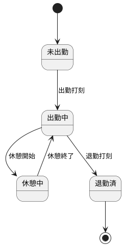
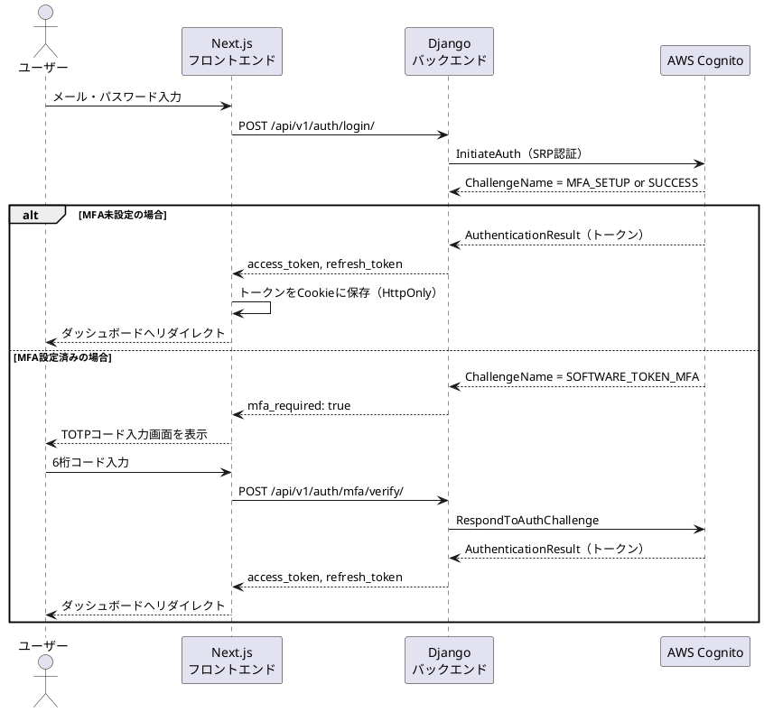
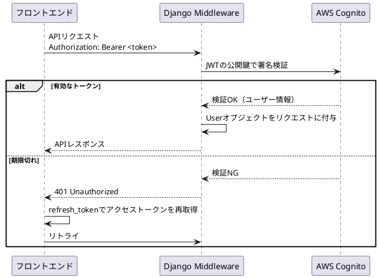
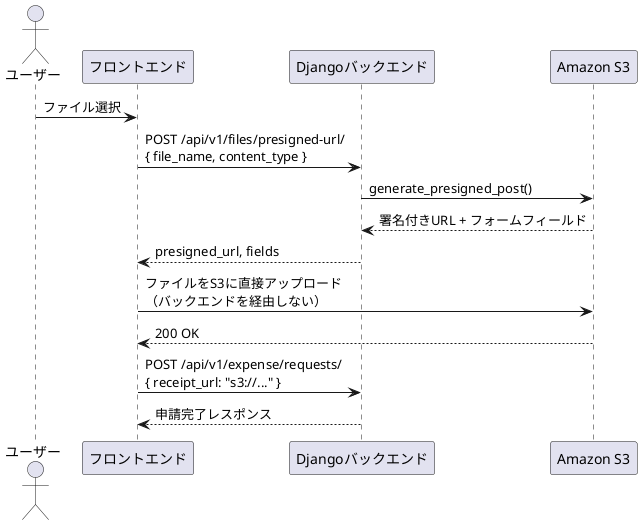
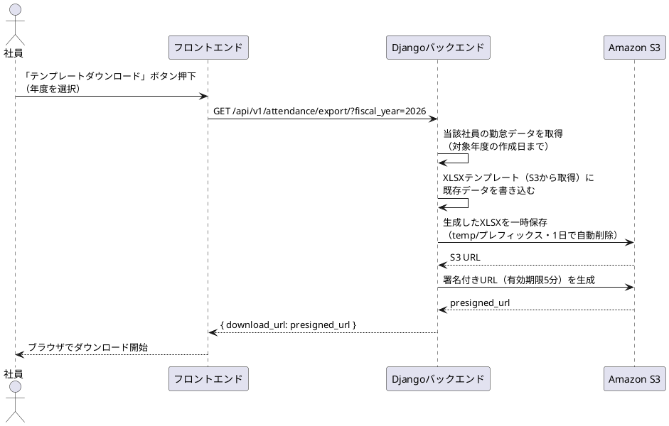

# 人事管理システム（HRM）詳細設計書

**作成日**: 2026-04-09  
**バージョン**: 1.0

---

## 目次

1. [DB詳細設計](#1-db詳細設計)
2. [API詳細設計](#2-api詳細設計)
3. [画面詳細設計](#3-画面詳細設計)
4. [認証フロー](#4-認証フロー)
5. [ファイル操作フロー](#5-ファイル操作フロー)
6. [ビジネスロジック詳細](#6-ビジネスロジック詳細)

---

## 1. DB詳細設計

### 1.1 ER図

```plantuml
@startuml
skinparam linetype ortho

entity "User\nユーザー" as user {
  * id : UUID <<PK>>
  --
  * email : VARCHAR(255) <<UNIQUE>>
  * cognito_sub : VARCHAR(255) <<UNIQUE>>
  * role : ENUM
  * is_active : BOOLEAN
  created_at : TIMESTAMP
  updated_at : TIMESTAMP
}

entity "Employee\n社員情報" as employee {
  * id : UUID <<PK>>
  --
  * user_id : UUID <<FK>>
  * employee_number : VARCHAR(20) <<UNIQUE>>
  * last_name : VARCHAR(50)
  * first_name : VARCHAR(50)
  * last_name_kana : VARCHAR(50)
  * first_name_kana : VARCHAR(50)
  * birth_date : DATE
  * gender : ENUM
  * hire_date : DATE
  retire_date : DATE
  * department : VARCHAR(100)
  * position : VARCHAR(100)
  * grade : INTEGER
  * employment_type : ENUM
  phone : VARCHAR(20)
  personal_email : VARCHAR(255)
  created_at : TIMESTAMP
  updated_at : TIMESTAMP
}

entity "EmployeeManager\n上司部下関係" as emp_manager {
  * employee_id : UUID <<FK>>
  * manager_id : UUID <<FK>>
}

entity "EmergencyContact\n緊急連絡先" as emergency {
  * id : UUID <<PK>>
  --
  * employee_id : UUID <<FK>>
  * name : VARCHAR(100)
  * relationship : VARCHAR(50)
  * phone : VARCHAR(20)
  sort_order : INTEGER
}

entity "FamilyMember\n家族構成" as family {
  * id : UUID <<PK>>
  --
  * employee_id : UUID <<FK>>
  * name : VARCHAR(100)
  * relationship : ENUM
  * birth_date : DATE
  * is_dependent : BOOLEAN
}

entity "Project\nプロジェクト" as project {
  * id : UUID <<PK>>
  --
  * code : VARCHAR(50) <<UNIQUE>>
  * name : VARCHAR(200)
  * manager_id : UUID <<FK>>
  * is_active : BOOLEAN
  start_date : DATE
  end_date : DATE
  created_at : TIMESTAMP
}

entity "AttendanceRecord\n勤怠記録" as attendance {
  * id : UUID <<PK>>
  --
  * employee_id : UUID <<FK>>
  project_id : UUID <<FK>>
  * date : DATE
  clock_in : TIME
  clock_out : TIME
  break_minutes : INTEGER
  * status : ENUM
  note : TEXT
  created_at : TIMESTAMP
  updated_at : TIMESTAMP
}

entity "AttendanceModRequest\n打刻修正申請" as att_mod {
  * id : UUID <<PK>>
  --
  * attendance_id : UUID <<FK>>
  * applicant_id : UUID <<FK>>
  approver_id : UUID <<FK>>
  * requested_clock_in : TIME
  * requested_clock_out : TIME
  reason : TEXT
  * status : ENUM
  approved_at : TIMESTAMP
  created_at : TIMESTAMP
}

entity "LeaveRequest\n休暇申請" as leave {
  * id : UUID <<PK>>
  --
  * employee_id : UUID <<FK>>
  approver_id : UUID <<FK>>
  * leave_type : ENUM
  * start_date : DATE
  * end_date : DATE
  * days : DECIMAL(4,1)
  reason : TEXT
  * status : ENUM
  approved_at : TIMESTAMP
  created_at : TIMESTAMP
}

entity "LeaveBalance\n有給残日数" as leave_balance {
  * id : UUID <<PK>>
  --
  * employee_id : UUID <<FK>>
  * fiscal_year : INTEGER
  * granted_days : DECIMAL(4,1)
  * used_days : DECIMAL(4,1)
  * carried_days : DECIMAL(4,1)
}

entity "MBOGoal\nMBO目標" as mbo_goal {
  * id : UUID <<PK>>
  --
  * employee_id : UUID <<FK>>
  * year : INTEGER
  * period : ENUM
  * title : VARCHAR(200)
  target_level : TEXT
  * weight : INTEGER
  self_score : DECIMAL(3,1)
  manager_score : DECIMAL(3,1)
  * status : ENUM
  created_at : TIMESTAMP
  updated_at : TIMESTAMP
}

entity "MBOReport\nMBO月間報告" as mbo_report {
  * id : UUID <<PK>>
  --
  * goal_id : UUID <<FK>>
  * month : DATE
  action_content : TEXT
  result : TEXT
  manager_comment : TEXT
  * status : ENUM
  created_at : TIMESTAMP
  updated_at : TIMESTAMP
}

entity "DailyReport\n日報" as daily_report {
  * id : UUID <<PK>>
  --
  * employee_id : UUID <<FK>>
  * report_date : DATE
  content : TEXT
  ai_suggestion : TEXT
  * status : ENUM
  created_at : TIMESTAMP
  updated_at : TIMESTAMP
}

entity "Skill\nスキル" as skill {
  * id : UUID <<PK>>
  --
  * employee_id : UUID <<FK>>
  * skill_name : VARCHAR(100)
  * category : ENUM
  * level : INTEGER
  certified_date : DATE
  expiry_date : DATE
  note : TEXT
}

entity "SalaryGrade\n給与等級マスタ" as salary_grade {
  * id : UUID <<PK>>
  --
  * grade : INTEGER <<UNIQUE>>
  * base_salary : DECIMAL(10,0)
  valid_from : DATE
  valid_to : DATE
}

entity "Allowance\n手当マスタ" as allowance {
  * id : UUID <<PK>>
  --
  * name : VARCHAR(100)
  * allowance_type : ENUM
  * amount : DECIMAL(10,0)
  * is_active : BOOLEAN
}

entity "EmployeeAllowance\n社員手当" as emp_allowance {
  * id : UUID <<PK>>
  --
  * employee_id : UUID <<FK>>
  * allowance_id : UUID <<FK>>
  amount : DECIMAL(10,0)
  valid_from : DATE
  valid_to : DATE
}

entity "Payslip\n給与明細" as payslip {
  * id : UUID <<PK>>
  --
  * employee_id : UUID <<FK>>
  * year : INTEGER
  * month : INTEGER
  * base_salary : DECIMAL(10,0)
  * total_allowances : DECIMAL(10,0)
  * overtime_pay : DECIMAL(10,0)
  * gross_salary : DECIMAL(10,0)
  * health_insurance : DECIMAL(10,0)
  * pension : DECIMAL(10,0)
  * employment_insurance : DECIMAL(10,0)
  * income_tax : DECIMAL(10,0)
  * resident_tax : DECIMAL(10,0)
  * total_deductions : DECIMAL(10,0)
  * net_salary : DECIMAL(10,0)
  * status : ENUM
  payslip_url : VARCHAR(500)
  created_at : TIMESTAMP
}

entity "AccountItem\n勘定科目" as account_item {
  * id : UUID <<PK>>
  --
  * code : VARCHAR(20) <<UNIQUE>>
  * name : VARCHAR(100)
  * category : ENUM
  * is_active : BOOLEAN
}

entity "ExpenseRequest\n経費申請" as expense {
  * id : UUID <<PK>>
  --
  * applicant_id : UUID <<FK>>
  approver_id : UUID <<FK>>
  * account_item_id : UUID <<FK>>
  * expense_type : ENUM
  * amount : DECIMAL(10,0)
  * expense_date : DATE
  description : TEXT
  receipt_url : VARCHAR(500)
  * status : ENUM
  approved_at : TIMESTAMP
  created_at : TIMESTAMP
}

entity "Notification\n通知" as notification {
  * id : UUID <<PK>>
  --
  * user_id : UUID <<FK>>
  * type : ENUM
  * title : VARCHAR(200)
  * message : TEXT
  related_url : VARCHAR(500)
  * is_read : BOOLEAN
  created_at : TIMESTAMP
}

' リレーション
user ||--|| employee
employee ||--o{ emp_manager : "employee_id"
employee ||--o{ emp_manager : "manager_id"
employee ||--o{ emergency
employee ||--o{ family
employee ||--o{ attendance
employee ||--o{ leave
employee ||--o{ leave_balance
employee ||--o{ mbo_goal
employee ||--o{ daily_report
employee ||--o{ skill
employee ||--o{ payslip
employee ||--o{ emp_allowance
employee ||--o{ expense : "applicant"
project ||--o{ attendance
attendance ||--o| att_mod
mbo_goal ||--o{ mbo_report
allowance ||--o{ emp_allowance
account_item ||--o{ expense
user ||--o{ notification

@enduml
```



---

### 1.2 テーブル定義詳細

#### User（ユーザー）
| カラム | 型 | 制約 | 説明 |
|---|---|---|---|
| id | UUID | PK | 主キー（自動生成） |
| email | VARCHAR(255) | NOT NULL, UNIQUE | ログインID |
| cognito_sub | VARCHAR(255) | NOT NULL, UNIQUE | CognitoのユーザーID |
| role | ENUM | NOT NULL | `employee` / `manager` / `hr` / `admin` |
| is_active | BOOLEAN | NOT NULL, DEFAULT TRUE | 有効フラグ |
| created_at | TIMESTAMP | NOT NULL | 作成日時（UTC） |
| updated_at | TIMESTAMP | NOT NULL | 更新日時（UTC） |

#### AttendanceRecord（勤怠記録）
| カラム | 型 | 制約 | 説明 |
|---|---|---|---|
| status | ENUM | NOT NULL | `draft`（下書き）/ `confirmed`（確定）/ `modified`（修正済） |
| break_minutes | INTEGER | DEFAULT 60 | 休憩時間（分） |

> **複合ユニーク制約**: `(employee_id, date)` ← 同じ社員が同じ日に2件登録不可

#### MBOGoal（MBO目標）
| カラム | 型 | 制約 | 説明 |
|---|---|---|---|
| period | ENUM | NOT NULL | `first_half`（上期）/ `second_half`（下期） |
| weight | INTEGER | DEFAULT 100 | ウェイト合計が100になるよう管理 |
| status | ENUM | NOT NULL | `draft` / `submitted` / `approved` / `evaluated` |

---

## 2. API詳細設計

### 2.1 共通仕様

- **ベースURL**: `/api/v1/`
- **認証**: `Authorization: Bearer <JWT_ACCESS_TOKEN>`
- **Content-Type**: `application/json`（ファイルアップロードは `multipart/form-data`）
- **ページネーション**: `?page=1&page_size=20`
- **日時フォーマット**: ISO 8601（`2026-04-09T09:00:00+09:00`）

#### エラーレスポンス共通形式
```json
{
  "error": {
    "code": "VALIDATION_ERROR",
    "message": "入力値が不正です",
    "details": {
      "email": ["有効なメールアドレスを入力してください"]
    }
  }
}
```

#### エラーコード一覧
| HTTPステータス | コード | 説明 |
|---|---|---|
| 400 | `VALIDATION_ERROR` | 入力値エラー |
| 401 | `UNAUTHORIZED` | 認証トークンなし・期限切れ |
| 403 | `FORBIDDEN` | 権限不足 |
| 404 | `NOT_FOUND` | リソースが存在しない |
| 409 | `CONFLICT` | 重複データ |
| 500 | `INTERNAL_ERROR` | サーバー内部エラー |

---

### 2.2 認証 API

#### POST `/api/v1/auth/login/`
Cognitoで認証し、JWT（アクセストークン＋リフレッシュトークン）を返す。

**リクエスト**
```json
{
  "email": "user@example.com",
  "password": "Password123!"
}
```
**レスポンス** `200 OK`
```json
{
  "access_token": "eyJhbGci...",
  "refresh_token": "eyJhbGci...",
  "expires_in": 3600,
  "user": {
    "id": "uuid",
    "email": "user@example.com",
    "role": "employee",
    "full_name": "山田 太郎"
  }
}
```

#### POST `/api/v1/auth/refresh/`
リフレッシュトークンで新しいアクセストークンを取得。

#### POST `/api/v1/auth/logout/`
リフレッシュトークンを無効化。

#### POST `/api/v1/auth/password/reset-request/`
パスワードリセットメールを送信。

#### POST `/api/v1/auth/mfa/setup/`
TOTP（ワンタイムパスワード）のQRコードを取得。

---

### 2.3 社員情報 API

#### GET `/api/v1/employees/`
社員一覧取得。人事担当・管理職のみアクセス可。

**クエリパラメータ**
| パラメータ | 型 | 説明 |
|---|---|---|
| `department` | string | 部署でフィルタ |
| `is_active` | boolean | 在籍中のみ: `true` |
| `search` | string | 氏名・社員番号で検索 |

**レスポンス** `200 OK`
```json
{
  "count": 50,
  "next": "/api/v1/employees/?page=2",
  "results": [
    {
      "id": "uuid",
      "employee_number": "E001",
      "full_name": "山田 太郎",
      "department": "開発部",
      "position": "エンジニア",
      "grade": 3,
      "is_active": true
    }
  ]
}
```

#### GET `/api/v1/employees/{id}/`
社員詳細取得。本人と人事担当・管理職がアクセス可。

#### PATCH `/api/v1/employees/{id}/`
社員情報更新。人事担当・管理者のみ。

#### GET `/api/v1/employees/{id}/organization/`
組織図データ（上司・部下一覧）を取得。

---

### 2.4 出退勤 API

#### POST `/api/v1/attendance/clock-in/`
出勤打刻。

**リクエスト**
```json
{
  "project_id": "uuid",
  "note": "テスト対応"
}
```
**レスポンス** `201 Created`
```json
{
  "id": "uuid",
  "date": "2026-04-09",
  "clock_in": "09:00:00",
  "status": "draft"
}
```

#### POST `/api/v1/attendance/clock-out/`
退勤打刻。当日のdraft記録を更新。

**リクエスト**
```json
{
  "break_minutes": 60
}
```

#### GET `/api/v1/attendance/`
勤怠一覧取得。

**クエリパラメータ**
| パラメータ | 型 | 説明 |
|---|---|---|
| `year_month` | string | 例: `2026-04` |
| `employee_id` | UUID | 管理職・人事担当のみ指定可 |

#### POST `/api/v1/attendance/modification-requests/`
打刻修正申請。

**リクエスト**
```json
{
  "attendance_id": "uuid",
  "requested_clock_in": "09:00:00",
  "requested_clock_out": "18:30:00",
  "reason": "打刻忘れのため"
}
```

#### PATCH `/api/v1/attendance/modification-requests/{id}/approve/`
修正申請を承認（管理職のみ）。

#### GET `/api/v1/attendance/summary/`
月次集計データ取得。

**レスポンス**
```json
{
  "year_month": "2026-04",
  "total_work_days": 20,
  "total_work_hours": "160:00",
  "total_overtime_hours": "8:30",
  "late_night_hours": "1:00",
  "holiday_work_hours": "0:00",
  "overtime_alert": false
}
```

#### GET `/api/v1/attendance/export/`
勤怠データをXLSXでエクスポート（年度単位、作成日までのデータ）。

**クエリパラメータ**: `?fiscal_year=2026`

#### POST `/api/v1/attendance/import/`
XLSXテンプレートをアップロードして一括更新。

**リクエスト**: `multipart/form-data`
| フィールド | 型 | 説明 |
|---|---|---|
| `file` | File | XLSXファイル |
| `fiscal_year` | integer | 年度 |

---

### 2.5 有給・休暇 API

#### GET `/api/v1/leave/balance/`
有給残日数取得。

**レスポンス**
```json
{
  "fiscal_year": 2026,
  "granted_days": 20.0,
  "used_days": 5.0,
  "carried_days": 10.0,
  "remaining_days": 25.0
}
```

#### POST `/api/v1/leave/requests/`
休暇申請。

**リクエスト**
```json
{
  "leave_type": "annual",
  "start_date": "2026-04-20",
  "end_date": "2026-04-21",
  "reason": "私用のため"
}
```

#### PATCH `/api/v1/leave/requests/{id}/approve/`
承認（管理職のみ）。

---

### 2.6 MBO API

#### GET `/api/v1/mbo/goals/`
MBO目標一覧取得。

**クエリパラメータ**: `?year=2026&period=first_half`

#### POST `/api/v1/mbo/goals/`
目標登録。

**リクエスト**
```json
{
  "year": 2026,
  "period": "first_half",
  "title": "新機能リリース3件達成",
  "target_level": "月1件以上のリリースを継続する",
  "weight": 40
}
```

#### POST `/api/v1/mbo/goals/{id}/submit/`
目標を上司に提出。

#### POST `/api/v1/mbo/reports/`
月間報告の登録・更新。

**リクエスト**
```json
{
  "goal_id": "uuid",
  "month": "2026-04-01",
  "action_content": "APIの設計・実装を行った",
  "result": "予定通り1件リリース完了"
}
```

#### POST `/api/v1/mbo/reports/{id}/ai-suggest/`
AI（Bedrock）による文章改善提案を取得。

**レスポンス**
```json
{
  "suggestions": {
    "action_content": "「APIの設計・実装を行った」→ 具体的な成果数値を追記することを推奨します。例：「REST API 5エンドポイントの設計・実装を完了し、単体テストカバレッジ80%を達成した」",
    "result": "定量的な指標（件数・時間・数値）を含めると評価しやすくなります"
  }
}
```

#### GET `/api/v1/mbo/goals/{id}/export/`
PDF・XLSXでエクスポート。`?format=pdf` または `?format=xlsx`

---

### 2.7 給与 API

#### GET `/api/v1/salary/payslips/`
給与明細一覧（本人のみ）。

#### GET `/api/v1/salary/payslips/{id}/download/`
給与明細PDFをダウンロード（S3の署名付きURLを返す）。

#### POST `/api/v1/salary/calculate/`
給与計算実行（人事担当のみ）。

**リクエスト**
```json
{
  "year": 2026,
  "month": 4,
  "employee_ids": ["uuid1", "uuid2"]
}
```

#### GET `/api/v1/salary/grades/`
等級別基本給マスタ一覧。

---

### 2.8 経費申請 API

#### POST `/api/v1/expense/requests/`
経費申請。

**リクエスト** `multipart/form-data`
| フィールド | 型 | 説明 |
|---|---|---|
| `expense_type` | string | `transportation` / `general` |
| `account_item_id` | UUID | 勘定科目 |
| `amount` | integer | 金額（円） |
| `expense_date` | date | 費用発生日 |
| `description` | string | 内容説明 |
| `receipt` | File | 領収書画像 |

#### GET `/api/v1/expense/account-items/export/`
勘定科目一覧をCSVでエクスポート。

#### POST `/api/v1/expense/account-items/import/`
CSVで勘定科目を一括更新（システム管理者のみ）。

---

### 2.9 スキル API

#### GET `/api/v1/skills/`
スキル一覧。`?employee_id=uuid`

#### POST `/api/v1/skills/`
スキル登録。

**リクエスト**
```json
{
  "skill_name": "Python",
  "category": "language",
  "level": 4,
  "certified_date": "2025-06-01",
  "expiry_date": null
}
```

---

### 2.10 通知 API

#### GET `/api/v1/notifications/`
通知一覧（未読件数付き）。

#### PATCH `/api/v1/notifications/{id}/read/`
既読にする。

#### PATCH `/api/v1/notifications/read-all/`
全て既読にする。

---

## 3. 画面詳細設計

### 3.1 ダッシュボード（社員向け）

**URL**: `/`

**表示コンテンツ**
| セクション | 内容 |
|---|---|
| 打刻ウィジェット | 出勤・退勤ボタン、現在の状態、今日の勤務時間 |
| 今月の勤務サマリ | 労働時間・残業時間・有給残日数 |
| TODOリスト | 未承認申請・未提出MBO報告・未読通知 |
| MBO進捗 | 今期の目標達成率（プログレスバー） |

---

### 3.2 打刻画面

**URL**: `/attendance`

**状態遷移**



**入力項目**
- プロジェクト選択（必須）：プルダウン
- 備考（任意）：テキスト入力

**勤怠カレンダー**
- 月次表示（前月・翌月ナビゲーション）
- 凡例：通常出勤 / 有給 / 欠勤 / 休日
- 日付クリックで詳細表示

---

### 3.3 打刻修正申請画面

**URL**: `/attendance/modification-requests/new`

**入力項目**
| 項目 | 型 | 必須 | バリデーション |
|---|---|---|---|
| 対象日付 | date picker | ○ | 過去30日以内 |
| 修正後 出勤時刻 | time picker | ○ | 退勤より前 |
| 修正後 退勤時刻 | time picker | ○ | 出勤より後 |
| 理由 | textarea | ○ | 最大500文字 |

---

### 3.4 MBO目標設定画面

**URL**: `/mbo/goals/new`

**入力項目**
| 項目 | 型 | 必須 | バリデーション |
|---|---|---|---|
| 年度・期 | select | ○ | — |
| 目標タイトル | text | ○ | 最大200文字 |
| 達成水準 | textarea | ○ | — |
| ウェイト（%） | number | ○ | 全目標合計が100になること |

**AIアシスト機能**
- 「AI添削」ボタン押下でBedrockを呼び出し
- 改善提案をモーダルで表示
- 「適用」ボタンで本文に反映

---

### 3.5 給与明細画面

**URL**: `/salary/payslips`

**表示レイアウト（明細詳細）**
```
┌──────────────────────────────┐
│  2026年4月分 給与明細          │
├──────────────┬───────────────┤
│ 【支給】      │               │
│ 基本給       │  ¥300,000     │
│ 住宅手当     │   ¥20,000     │
│ 残業手当     │   ¥15,000     │
│ 支給合計     │  ¥335,000     │
├──────────────┼───────────────┤
│ 【控除】      │               │
│ 健康保険料   │   ¥16,000     │
│ 厚生年金     │   ¥29,000     │
│ 雇用保険     │    ¥1,000     │
│ 所得税       │   ¥10,000     │
│ 住民税       │   ¥15,000     │
│ 控除合計     │   ¥71,000     │
├──────────────┼───────────────┤
│ 【差引支給額】 │  ¥264,000     │
└──────────────┴───────────────┘
```

---

## 4. 認証フロー

### 4.1 ログインフロー



### 4.2 API認証フロー（リクエストごと）



---

## 5. ファイル操作フロー

### 5.1 ファイルアップロードフロー（S3署名付きURL）



> **S3直接アップロードの利点**: 大きなファイルをDjangoサーバーに転送しないため、サーバー負荷が下がりコストも削減できます。

### 5.2 テンプレートXLSXダウンロードフロー



### 5.3 勘定科目CSVフロー

**エクスポート**
1. `GET /api/v1/expense/account-items/export/` を呼び出す
2. DjangoがDBから全勘定科目を取得
3. CSV形式に変換してStreamingResponseで返す

**インポート**
1. CSVファイルを選択してアップロード
2. Djangoでバリデーション（コードの重複・必須項目チェック）
3. エラーがあれば行番号付きでエラー一覧を返す
4. 問題なければDBを一括更新（upsert：既存は上書き、新規は追加）

**CSVフォーマット**
```csv
code,name,category,is_active
1001,旅費交通費,expense,true
1002,消耗品費,expense,true
2001,接待交際費,entertainment,true
```

---

## 6. ビジネスロジック詳細

### 6.1 残業時間計算ルール

```
実労働時間 = (退勤時刻 - 出勤時刻) - 休憩時間

[残業種別]
通常残業  : 実労働時間 > 8時間 の超過分（25%割増）
深夜残業  : 22:00〜翌5:00 の労働時間（25%割増 ※通常残業と重複時は合算50%）
休日労働  : 法定休日（日曜）の労働（35%割増）
```

### 6.2 36協定アラートルール

```
月間残業時間 >= 40時間 → 警告通知（本人・管理職・人事担当）
月間残業時間 >= 80時間 → 緊急通知（同上）
```

### 6.3 給与計算ロジック

```
【支給額計算】
gross_salary = base_salary
             + Σ(allowances)
             + overtime_pay（残業代）

【社会保険料計算】（標準報酬月額から）
health_insurance     = 標準報酬月額 × 健康保険料率（都道府県別） / 2
pension              = 標準報酬月額 × 0.183 / 2  ← 厚生年金（折半）
employment_insurance = gross_salary × 0.006        ← 雇用保険

【所得税計算】
課税所得 = gross_salary - 社会保険料合計 - 給与所得控除
income_tax = 課税所得 に対する源泉徴収税額表を参照

【差引支給額】
net_salary = gross_salary - health_insurance - pension
           - employment_insurance - income_tax - resident_tax
```

### 6.4 有給付与ロジック

| 勤続年数 | 付与日数 |
|---|---|
| 6ヶ月 | 10日 |
| 1年6ヶ月 | 11日 |
| 2年6ヶ月 | 12日 |
| 3年6ヶ月 | 14日 |
| 4年6ヶ月 | 16日 |
| 5年6ヶ月 | 18日 |
| 6年6ヶ月以上 | 20日 |

- 繰越は最大**20日**まで
- 付与日 = 入社日から6ヶ月後、以降1年ごと
- Djangoのcelery-beatで毎日0時にバッチ処理

### 6.5 MBOウェイト合計チェック

- 同一社員・同一年・同一期の全目標のweight合計 = **100** であること
- 提出時にバリデーション。合計が100でない場合は `400 VALIDATION_ERROR`

### 6.6 AI補助機能（Bedrock呼び出し）

**プロンプト設計（MBO月間報告の添削）**
```
あなたは人事評価の専門家です。
以下のMBO月間報告の文章を評価し、改善提案を行ってください。

【評価観点】
1. 具体性：数値・件数・期日が含まれているか
2. 結果明確性：行動の結果・成果が明確か
3. 目標との紐付き：目標に対する貢献が分かるか

【入力文章】
行動内容: {action_content}
結果・考察: {result}

【出力形式（JSON）】
{
  "action_content_suggestion": "改善提案文",
  "result_suggestion": "改善提案文",
  "overall_score": 1-5,
  "feedback": "総合コメント"
}
```

**使用モデル**: `anthropic.claude-sonnet-4-5-20250929-v1:0`
