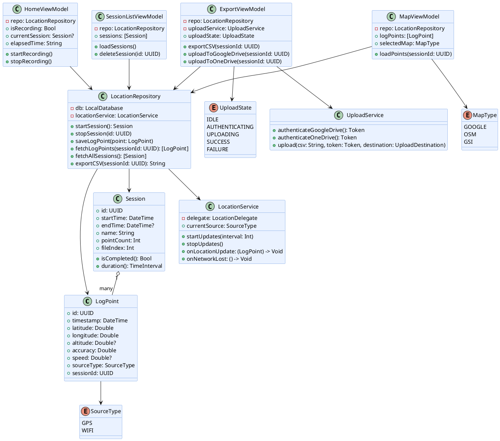
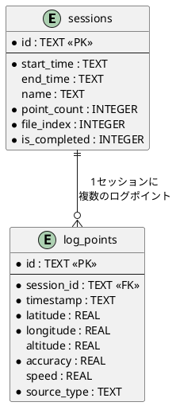
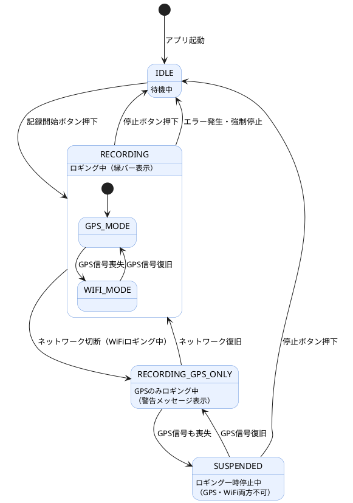
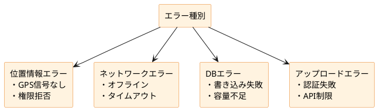
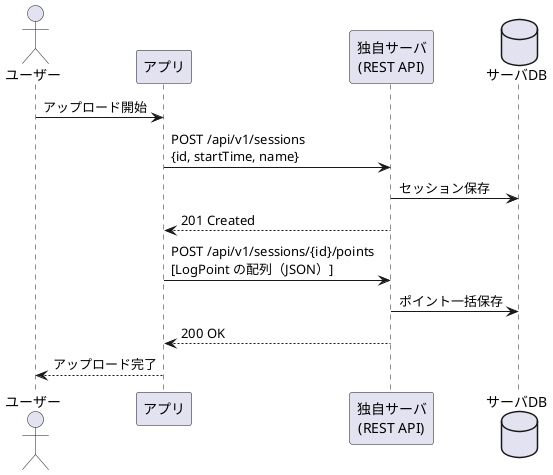

# GPSLogger アプリ 詳細設計書

> 作成日: 2026-04-09
> 対応する基本設計: design.md

---

## 目次

1. [クラス図](#1-クラス図)
2. [DBスキーマ（ER図）](#2-dbスキーマer図)
3. [状態遷移図](#3-状態遷移図)
4. [画面詳細仕様](#4-画面詳細仕様)
5. [ファイル・ディレクトリ構成](#5-ファイルディレクトリ構成)
6. [エラー処理仕様](#6-エラー処理仕様)
7. [設定仕様](#7-設定仕様)
8. [将来の独自サーバAPI仕様](#8-将来の独自サーバapi仕様)

---

## 1. クラス図

アプリ全体のクラス（= コードの設計図）の関係を示す。



---

## 2. DBスキーマ（ER図）

ER図（Entity-Relationship Diagram）= テーブルの構造と関係を示す図。



### テーブル定義

#### sessions テーブル
| カラム名 | 型 | 必須 | 説明 |
|----------|----|------|------|
| id | TEXT (UUID) | YES | 主キー |
| start_time | TEXT (ISO8601) | YES | 記録開始時刻 |
| end_time | TEXT (ISO8601) | NO | 記録終了時刻（記録中はNULL） |
| name | TEXT | NO | セッション名（ユーザー任意入力） |
| point_count | INTEGER | YES | 記録ポイント数 |
| file_index | INTEGER | YES | ファイル連番（1年超で増加） |
| is_completed | INTEGER (0/1) | YES | 完了フラグ |

#### log_points テーブル
| カラム名 | 型 | 必須 | 説明 |
|----------|----|------|------|
| id | TEXT (UUID) | YES | 主キー |
| session_id | TEXT (UUID) | YES | 外部キー → sessions.id |
| timestamp | TEXT (ISO8601) | YES | 記録時刻 |
| latitude | REAL | YES | 緯度（例: 35.681236） |
| longitude | REAL | YES | 経度（例: 139.767125） |
| altitude | REAL | NO | 高度（m） |
| accuracy | REAL | YES | 水平精度（m） |
| speed | REAL | NO | 速度（m/s） |
| source_type | TEXT | YES | "GPS" または "WIFI" |

---

## 3. 状態遷移図

アプリのロギング機能が取りうる**状態の変化**を示す。



---

## 4. 画面詳細仕様

### 4.1 初期画面（スプラッシュ）

| 要素 | 仕様 |
|------|------|
| 表示時間 | 約1.5秒 |
| 表示内容 | アプリロゴ・アプリ名 |
| 処理 | DB初期化・前回セッション確認 |
| 遷移先 | ホーム画面（前回セッション未完了の場合はダイアログ表示） |

### 4.2 ホーム画面

| 要素 | 仕様 |
|------|------|
| 記録開始ボタン | 大きな円形ボタン（緑色） |
| 停止ボタン | 記録中のみ表示（赤色） |
| ステータスバー | 画面最上部の緑色バー（ロギング中のみ） |
| 経過時間表示 | ロギング中は「HH:MM:SS」形式でリアルタイム表示 |
| 現在の測位モード | "GPS" / "WiFi" をアイコンで表示 |
| 直近座標表示 | 緯度・経度・精度をリアルタイム表示 |

### 4.3 セッション一覧画面

| 要素 | 仕様 |
|------|------|
| リスト表示 | セッション名・開始日時・記録時間・ポイント数 |
| ソート | 新しい順（デフォルト） |
| スワイプ操作 | 左スワイプで削除 |
| タップ | セッション詳細画面へ遷移 |

### 4.4 セッション詳細画面

| 要素 | 仕様 |
|------|------|
| ヘッダー | セッション名・開始〜終了時刻・総距離 |
| 地図ビュー | デフォルトはOSM、切替ボタンで Google / 地理院 に変更 |
| ポイントリスト | タブで地図ビュー ↔ リストビュー切替 |
| エクスポートボタン | エクスポート画面へ遷移 |

### 4.5 エクスポート画面

| 要素 | 仕様 |
|------|------|
| CSV保存ボタン | 端末のファイルアプリ / 共有シートへ出力 |
| Google Drive ボタン | OAuth認証後アップロード |
| OneDrive ボタン | OAuth認証後アップロード |
| 進行状態表示 | アップロード中はプログレスバー表示 |

### 4.6 設定画面

| 設定項目 | 型 | デフォルト | 備考 |
|----------|----|-----------|------|
| 記録間隔 | 数値入力（秒） | 1秒 | 1〜3600秒の範囲 |
| デフォルト地図 | セレクター | OSM | Google / OSM / 地理院 |
| セッション名 自動生成 | トグル | ON | "2026-04-09 10:00" 形式 |
| ファイル自動切替閾値 | 数値入力（日） | 365日 | 最大ロギング期間 |

---

## 5. ファイル・ディレクトリ構成

### iOS（Swift）

```
GPSLogger/
├── App/
│   └── GPSLoggerApp.swift        # アプリのエントリーポイント
├── Views/
│   ├── SplashView.swift          # 初期画面
│   ├── HomeView.swift            # ホーム画面
│   ├── SessionListView.swift     # セッション一覧
│   ├── SessionDetailView.swift   # セッション詳細
│   ├── MapView.swift             # 地図表示
│   ├── ExportView.swift          # エクスポート
│   └── SettingsView.swift        # 設定
├── ViewModels/
│   ├── HomeViewModel.swift
│   ├── SessionListViewModel.swift
│   ├── MapViewModel.swift
│   └── ExportViewModel.swift
├── Models/
│   ├── LogPoint.swift
│   ├── Session.swift
│   ├── SourceType.swift
│   └── MapType.swift
├── Services/
│   ├── LocationService.swift     # CoreLocation ラッパー
│   └── UploadService.swift       # Google Drive / OneDrive API
├── Repository/
│   └── LocationRepository.swift  # DB操作の窓口
├── Database/
│   └── CoreDataStack.swift       # CoreData 初期化・管理
├── Resources/
│   └── GPSLogger.xcdatamodeld   # CoreData モデル定義
└── Watch Extension/
    ├── WatchHomeView.swift
    └── WatchViewModel.swift
```

### Android（Kotlin）

```
app/src/main/
├── java/com/example/gpslogger/
│   ├── MainActivity.kt           # エントリーポイント
│   ├── ui/
│   │   ├── splash/SplashScreen.kt
│   │   ├── home/HomeScreen.kt
│   │   ├── session/SessionListScreen.kt
│   │   ├── detail/SessionDetailScreen.kt
│   │   ├── map/MapScreen.kt
│   │   ├── export/ExportScreen.kt
│   │   └── settings/SettingsScreen.kt
│   ├── viewmodel/
│   │   ├── HomeViewModel.kt
│   │   ├── SessionListViewModel.kt
│   │   ├── MapViewModel.kt
│   │   └── ExportViewModel.kt
│   ├── model/
│   │   ├── LogPoint.kt
│   │   └── Session.kt
│   ├── service/
│   │   ├── LocationForegroundService.kt  # Foreground Service
│   │   └── UploadService.kt
│   ├── repository/
│   │   └── LocationRepository.kt
│   └── database/
│       ├── AppDatabase.kt        # Room Database
│       ├── LogPointDao.kt        # DB操作インターフェース
│       └── SessionDao.kt
└── res/
    └── ...
```

---

## 6. エラー処理仕様



| エラー種別 | 原因 | ユーザーへの表示 | アプリの動作 |
|------------|------|-----------------|-------------|
| GPS権限なし | 権限未許可 | 「設定からGPS権限を許可してください」+ 設定画面へのリンク | ロギング開始不可 |
| GPS信号なし | 屋内・電波不良 | 「GPS信号が取得できません（WiFiに切替）」 | WiFiへ自動フォールバック |
| WiFi切断 | ネットワーク喪失 | 「WiFi測位が利用できません」 | GPSのみ継続（GPSあれば） |
| 両方喪失 | GPS・WiFi両不可 | 「測位できません。ロギングを一時停止中」 | ロギング一時停止 |
| DB書き込み失敗 | ストレージ満杯 | 「ストレージが不足しています。不要なデータを削除してください」 | ロギング停止 |
| アップロード認証失敗 | トークン期限切れ | 「再度ログインが必要です」 | 再認証フロー起動 |
| アップロード失敗 | ネットワーク・API制限 | 「アップロードに失敗しました。後でお試しください」 | ローカルCSVは保持 |

---

## 7. 設定仕様

### 設定項目の保存方法
| プラットフォーム | 保存場所 |
|-----------------|---------|
| iOS | `UserDefaults` |
| Android | `DataStore Preferences` |

### 設定キー一覧
| キー名 | 型 | デフォルト値 | 説明 |
|--------|----|-------------|------|
| `recording_interval_sec` | Int | 1 | 記録間隔（秒） |
| `default_map_type` | String | "OSM" | デフォルト地図種別 |
| `auto_session_name` | Bool | true | セッション名自動生成 |
| `max_logging_days` | Int | 365 | 最大ロギング日数 |
| `last_session_id` | String? | null | 前回セッションID（復元用） |

---

## 8. 将来の独自サーバAPI仕様

> 現状は Google Drive / OneDrive を利用。将来的に独自サーバへ移行する際の設計案。

### エンドポイント一覧

| メソッド | パス | 説明 |
|----------|------|------|
| POST | `/api/v1/sessions` | セッション登録 |
| POST | `/api/v1/sessions/{id}/points` | ログポイントの一括送信 |
| GET | `/api/v1/sessions` | セッション一覧取得 |
| GET | `/api/v1/sessions/{id}/export` | CSV形式でエクスポート |
| DELETE | `/api/v1/sessions/{id}` | セッション削除 |

### シーケンス図（将来の独自API連携）



### リクエスト例（ログポイント送信）
```json
POST /api/v1/sessions/uuid-xxx/points
Content-Type: application/json

{
  "points": [
    {
      "id": "uuid-1",
      "timestamp": "2026-04-09T10:00:00+09:00",
      "latitude": 35.681236,
      "longitude": 139.767125,
      "altitude": 5.2,
      "accuracy": 3.0,
      "speed": 1.2,
      "sourceType": "GPS"
    }
  ]
}
```
